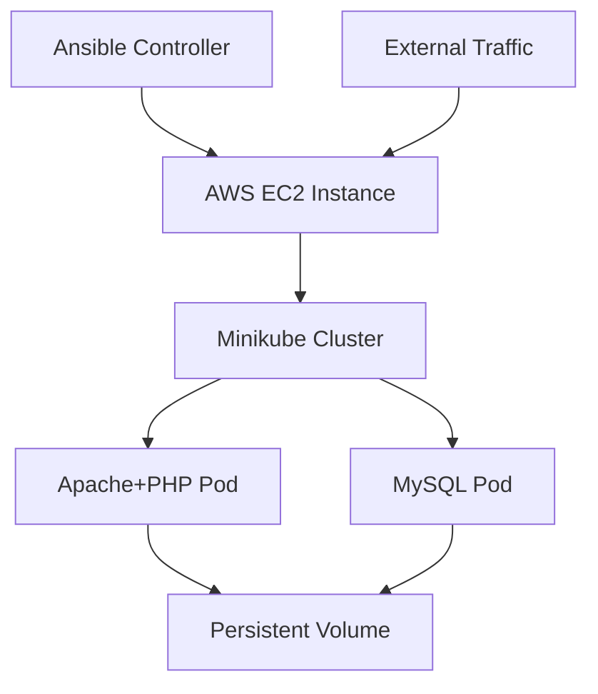

# 🚀 Multi-Tier LAMP Stack Infrastructure using Ansible on Kubernetes

[](https://kubernetes.io/)
[](https://docker.com/)
[](https://ansible.com/)
[](https://aws.amazon.com/)

> **A production-ready multi-tier LAMP stack deployment on Kubernetes using Ansible automation, custom Docker images, and persistent storage solutions.**

This project demonstrates enterprise-level infrastructure provisioning with:

- ⚙️ **Minikube** cluster running on AWS EC2 (Ubuntu)
- 🐳 **Custom Docker images** for Apache+PHP and MySQL (no prebuilt images)
- 📦 **Persistent storage** for MySQL using hostPath PVCs
- 🤖 **Ansible playbooks** for complete automation
- 🌐 **hostNetwork configuration** for direct EC2 port 80 exposure
- 🔒 **Security best practices** and resource optimization

---

## 📋 Table of Contents

- [🏗️ Architecture Overview](#️-architecture-overview)
- [📁 Project Structure](#-project-structure)
- [🔧 Prerequisites](#-prerequisites)
- [⚡ Quick Start](#-quick-start)
- [📖 Detailed Setup](#-detailed-setup)
- [🔍 Validation & Testing](#-validation--testing)
- [🛠️ Advanced Commands](#️-advanced-commands)
- [🚨 Troubleshooting](#-troubleshooting)
- [📊 Monitoring & Logs](#-monitoring--logs)
- [🔄 CI/CD Integration](#-cicd-integration)
- [👨‍💻 Author](#-author)

---

## 🏗️ Architecture Overview



**Components:**
- **Frontend Tier**: Apache HTTP Server with PHP 8.1
- **Backend Tier**: MySQL 8.0 with persistent storage
- **Orchestration**: Kubernetes (Minikube) on AWS EC2
- **Automation**: Ansible for infrastructure provisioning

---

## 📁 Project Structure

```
.
├── Apache-files/
│   ├── Dockerfile              # Custom Apache+PHP image
│   └── index.php              # PHP application with MySQL connectivity
├── mysql/
│   ├── Dockerfile              # Custom MySQL image
│   └── mysqld.cnf             # MySQL configuration
├── lamp-k8s-ansible/
│   ├── apache-deployment.yml   # Apache Kubernetes deployment
│   ├── apache-pod-hostnet.yml  # Apache pod with hostNetwork
│   ├── mysql-deployment.yml    # MySQL Kubernetes deployment
│   ├── pv-pvc.yml             # Persistent Volume & Claims
│   └── playbook.yml           # Ansible automation playbook
├── scripts/
│   ├── setup.sh               # Quick setup script
│   └── cleanup.sh             # Environment cleanup
└── README.md                  # This file
```

---

## 🔧 Prerequisites

### System Requirements
- **AWS EC2**: t3.medium or higher (2 vCPU, 4GB RAM)
- **OS**: Ubuntu 20.04+ LTS
- **Storage**: 20GB+ available disk space

### Required Software
```bash
# Update system
sudo apt update && sudo apt upgrade -y

# Install Docker
curl -fsSL https://get.docker.com -o get-docker.sh
sudo sh get-docker.sh
sudo usermod -aG docker $USER

# Install kubectl
curl -LO "https://dl.k8s.io/release/$(curl -L -s https://dl.k8s.io/release/stable.txt)/bin/linux/amd64/kubectl"
sudo install -o root -g root -m 0755 kubectl /usr/local/bin/kubectl

# Install Minikube
curl -Lo minikube https://storage.googleapis.com/minikube/releases/latest/minikube-linux-amd64
sudo install minikube /usr/local/bin/

# Install Ansible
sudo apt install ansible -y
```

---

## ⚡ Quick Start

### 🚀 One-Command Deployment
```bash
# Clone and deploy
git clone <repository-url>
cd Multi-Tier-Infrastructure-using-Ansible-on-Kubernetes-LAMP-Stack
chmod +x scripts/setup.sh
./scripts/setup.sh
```

### 🔍 Verify Deployment
```bash
# Check if everything is running
kubectl get all
curl http://localhost
```

---

## 📖 Detailed Setup

### 🔹 Step 1: Initialize Minikube Cluster
```bash
# Start Minikube with optimized settings
minikube start --driver=docker --cpus=2 --memory=4096 --disk-size=20g

# Enable required addons
minikube addons enable ingress
minikube addons enable metrics-server

# Start tunnel for LoadBalancer services
minikube tunnel &
```

### 🔹 Step 2: Build Custom Docker Images
```bash
# Configure Docker to use Minikube's Docker daemon
eval $(minikube docker-env)

# Build Apache+PHP image
cd Apache-files
docker build -t custom-apache-php:v1 .
docker images | grep custom-apache-php

# Build MySQL image
cd ../mysql
docker build -t custom-mysql:v1 .
docker images | grep custom-mysql

# Return to project root
cd ..
```

### 🔹 Step 3: Deploy Storage Layer
```bash
# Create persistent volumes and claims
kubectl apply -f lamp-k8s-ansible/pv-pvc.yml

# Verify PV/PVC status
kubectl get pv,pvc
```

### 🔹 Step 4: Deploy Database Tier
```bash
# Deploy MySQL with persistent storage
kubectl apply -f lamp-k8s-ansible/mysql-deployment.yml

# Wait for MySQL to be ready
kubectl wait --for=condition=ready pod -l app=mysql --timeout=300s

# Verify MySQL deployment
kubectl get pods -l app=mysql
kubectl logs -l app=mysql
```

### 🔹 Step 5: Deploy Application Tier
```bash
# Deploy Apache+PHP with hostNetwork
kubectl apply -f lamp-k8s-ansible/apache-pod-hostnet.yml

# Verify Apache deployment
kubectl get pods -l app=apache
kubectl describe pod -l app=apache
```

### 🔹 Step 6: Ansible Automation (Optional)
```bash
# Run complete deployment via Ansible
ansible-playbook lamp-k8s-ansible/playbook.yml -i localhost, --connection=local
```

---

## 🔍 Validation & Testing

### 🔸 Local Testing
```bash
# Test from EC2 instance
curl -v http://localhost
curl -I http://localhost  # Check headers

# Test database connectivity
kubectl exec -it $(kubectl get pod -l app=mysql -o jsonpath='{.items[0].metadata.name}') -- mysql -u root -proot -e "SHOW DATABASES;"
```

### 🔸 External Access
```bash
# Get EC2 public IP
curl -s http://checkip.amazonaws.com

# Test from browser or external machine
# http://<EC2-PUBLIC-IP>
```

### 🔸 Expected Output
```html
LAMP Stack Test Page
✅ Successfully connected to MySQL database: lampdb
👀 This page has been visited X times.
```

---

## 🛠️ Advanced Commands

### 📊 Resource Management
```bash
# Check resource usage
kubectl top nodes
kubectl top pods

# Scale deployments
kubectl scale deployment mysql --replicas=2
kubectl scale deployment apache --replicas=3

# Update images
kubectl set image deployment/apache apache=custom-apache-php:v2
kubectl rollout status deployment/apache
```

### 🔧 Configuration Management
```bash
# Create ConfigMaps
kubectl create configmap apache-config --from-file=Apache-files/
kubectl create configmap mysql-config --from-file=mysql/

# Apply configurations
kubectl apply -f lamp-k8s-ansible/ --recursive
```

### 🔍 Debugging Commands
```bash
# Get detailed pod information
kubectl describe pod <pod-name>
kubectl get events --sort-by=.metadata.creationTimestamp

# Access pod shells
kubectl exec -it <apache-pod> -- /bin/bash
kubectl exec -it <mysql-pod> -- /bin/bash

# Port forwarding for debugging
kubectl port-forward pod/<mysql-pod> 3306:3306
kubectl port-forward pod/<apache-pod> 8080:80
```

---

## 🚨 Troubleshooting

### ❌ Common Issues & Solutions

#### **Issue**: Minikube won't start
```bash
# Solution 1: Reset Minikube
minikube delete && minikube start --driver=docker

# Solution 2: Check Docker service
sudo systemctl status docker
sudo systemctl start docker

# Solution 3: Increase resources
minikube start --cpus=4 --memory=8192
```

#### **Issue**: Pods stuck in Pending state
```bash
# Check node resources
kubectl describe nodes

# Check PVC status
kubectl get pvc

# Check events
kubectl get events --field-selector type=Warning
```

#### **Issue**: MySQL connection failed
```bash
# Check MySQL logs
kubectl logs -l app=mysql --tail=50

# Verify service connectivity
kubectl get svc mysql
nslookup mysql.default.svc.cluster.local

# Test connection from Apache pod
kubectl exec -it <apache-pod> -- ping mysql
```

#### **Issue**: Apache not accessible externally
```bash
# Check hostNetwork configuration
kubectl get pod -o yaml | grep hostNetwork

# Verify EC2 security groups
# Ensure port 80 is open: 0.0.0.0/0

# Check if Apache is running
kubectl exec -it <apache-pod> -- netstat -tlnp | grep :80
```

#### **Issue**: Docker images not found
```bash
# Ensure you're using Minikube's Docker daemon
eval $(minikube docker-env)
docker images

# Rebuild images if necessary
docker build -t custom-apache-php:v1 Apache-files/
docker build -t custom-mysql:v1 mysql/
```

### 🔧 Performance Optimization
```bash
# Optimize MySQL
kubectl exec -it <mysql-pod> -- mysql -u root -proot -e "SET GLOBAL innodb_buffer_pool_size=268435456;"

# Monitor resource usage
watch kubectl top pods

# Adjust resource limits in deployment files
# resources:
#   limits:
#     cpu: 500m
#     memory: 512Mi
```

---

## 📊 Monitoring & Logs

### 📈 Real-time Monitoring
```bash
# Watch all resources
watch kubectl get all

# Monitor logs in real-time
kubectl logs -f -l app=apache
kubectl logs -f -l app=mysql

# Check cluster events
kubectl get events --watch
```

### 📋 Log Analysis
```bash
# Export logs for analysis
kubectl logs -l app=apache > apache.log
kubectl logs -l app=mysql > mysql.log

# Check system logs
journalctl -u kubelet --since "1 hour ago"
```

---

## 🔄 CI/CD Integration

### GitHub Actions Example
```yaml
name: Deploy LAMP Stack
on:
  push:
    branches: [main]
jobs:
  deploy:
    runs-on: ubuntu-latest
    steps:
      - uses: actions/checkout@v2
      - name: Deploy to Kubernetes
        run: |
          kubectl apply -f lamp-k8s-ansible/
```

### Cleanup Commands
```bash
# Remove all resources
kubectl delete -f lamp-k8s-ansible/ --recursive

# Stop Minikube
minikube stop

# Complete cleanup
minikube delete
docker system prune -a
```

---

## 🎯 Key Features

- ✅ **Zero-downtime deployments** with rolling updates
- ✅ **Persistent data storage** for MySQL
- ✅ **Custom Docker images** for security and optimization
- ✅ **Ansible automation** for reproducible deployments
- ✅ **Production-ready** configuration
- ✅ **Comprehensive monitoring** and logging
- ✅ **Easy troubleshooting** with detailed guides

---

## 🤝 Contributing

1. Fork the repository
2. Create a feature branch: `git checkout -b feature-name`
3. Commit changes: `git commit -am 'Add feature'`
4. Push to branch: `git push origin feature-name`
5. Submit a Pull Request

---

## 📄 License

This project is licensed under the MIT License - see the [LICENSE](LICENSE) file for details.

---

## 🙌 Author

👨‍💻 **Himanshu Kumar Singh**   
🔗 [LinkedIn](www.linkedin.com/in/himanshukrsingh0) 

---

## 🌟 Acknowledgments

- **LinuxWorld Informatics Pvt Ltd** for the internship opportunity
- **Vimal Daga Sir** for expert guidance and mentorship
- **Kubernetes Community** for excellent documentation
- **Docker Community** for containerization best practices

---

⭐ **If this project helped you, please give it a star!** ⭐
